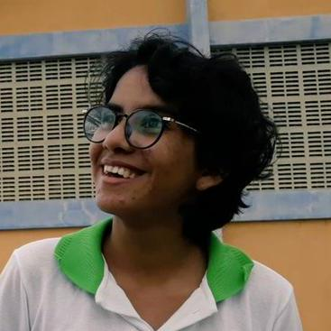

## Bem-vindo ao meu portifólio
### Game Designer, Designer, Animadora e Programadora 
# aaa
#### bb

- Meu nome é Iara Kelly, tenho 17 anos e atualmente curso o terceiro ano do curso técnico integrado de programação de jogos digitais no IFRN (Instituto Federal de Educação, Ciência e ecnologia do Rio Grande Do norte), Campus Ceará-mirim, cidade a qual moro desde sempre. O objetivo da criação desse site é a exposição dos trabalhos e jogos confecionados ao decorrer da minha passagem pelo campus.
- Sou fã de animes, jogos e comidas, especialmente pastel de chocolate, meu animal favorito é a capivara, tenho muitos sonhos

