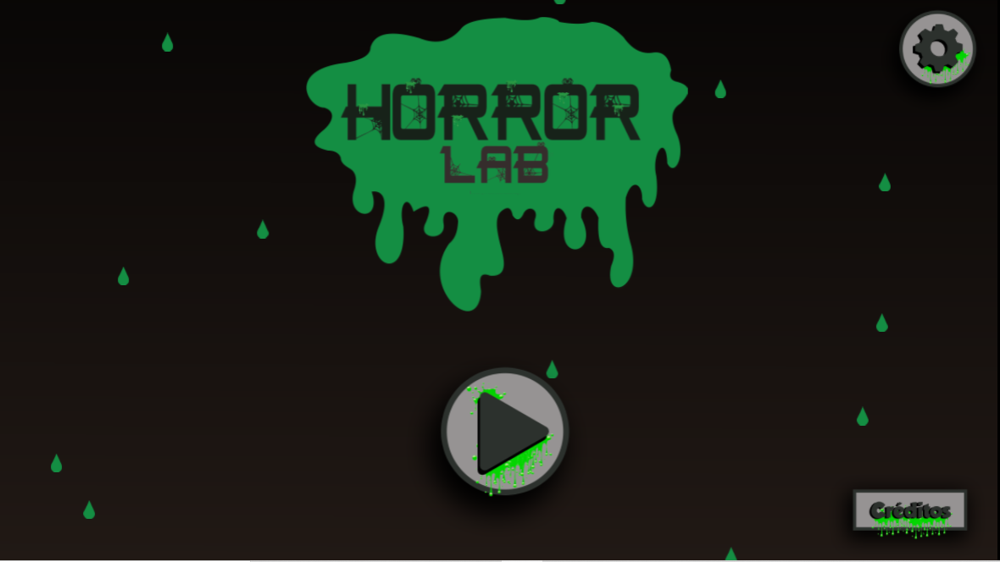

## Bem-vindo(a) ao meu portifólio
### Game Designer, Designer, Animadora e Programadora 

- Meu nome é Iara Kelly, tenho 17 anos e atualmente curso o terceiro ano do curso técnico integrado de programação de jogos digitais no IFRN (Instituto Federal de Educação, Ciência e ecnologia do Rio Grande Do norte), Campus Ceará-mirim, cidade a qual moro desde sempre. O objetivo da criação desse site é a exposição dos trabalhos e jogos confecionados ao decorrer da minha passagem pelo campus.
- Sou fã de animes, jogos e comidas, especialmente pastel de chocolate, meu animal favorito é a capivara.

# JOGOS

## JOGO 1: Super Pam
*DESCRIÇÃO:* Super Pam é um jogo que buscar disserminar um pouco de conhcecimento a respeito dos absorventes de pano e outras alternativas melhores que os abssorvente descartáveis, já que eles geram uma enorme pegada ambiental.

## JOGO 2: Horror Lab
*DESCRIÇÃO:* Em Horror Lab temos um jogo de suspense, em que Fred um "Exterminador", é chamado para ajudar um doutor que teve problemas em seu laboratório após algumas experiências sairem um pouco do controle.

## JOGO 3: AREA 51: Away from home
*DESCRIÇÃO:* Em "Away from Home" temos a história do alien Winona que acabou ficando preso na área 51 após sua nave cair na terra, agora ele precisa fugir e retornar para seu lar.

## JOGO 4: Aventura na floresta
*DESCRIÇÃO:* Em "Aventuura na floresta" você precisa ajudar um garotinho que se perdeu no parque ambiental durante uma longa excurssão.

